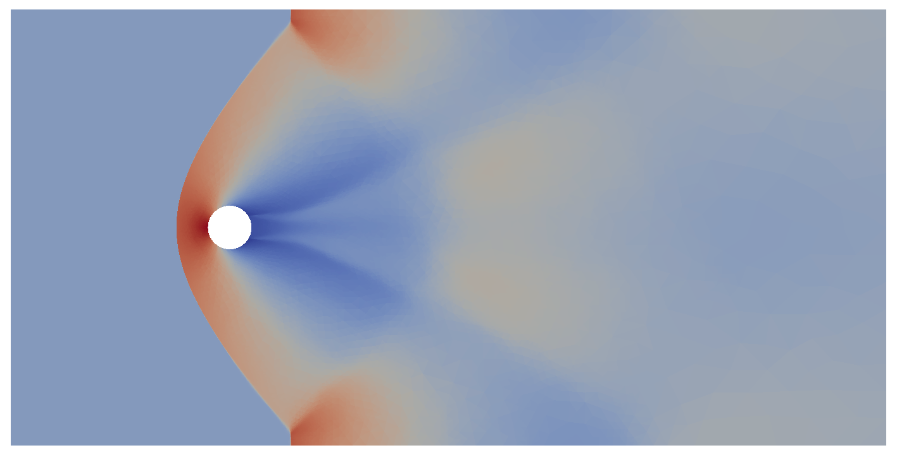
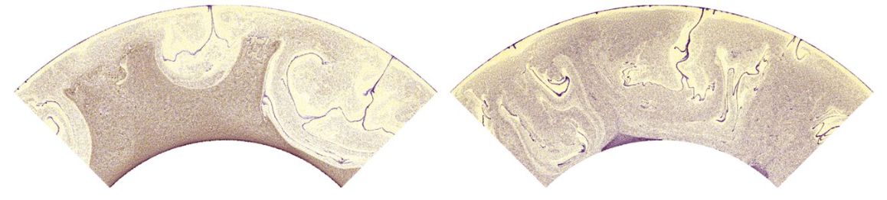

## FEniCS project

The [FEniCS project](https://fenicsproject.org/) comprises a number of
libraries as a general toolbox for the computation of the finite element
discretisation of partial differential euqations. For example, consider a
standard linear finite element formulation which reads: find $$u_h \in V^h$$
such that

$$
a(u_h, v) = l(v) \quad \forall v \in V^h,
$$

where $$u_h$$ and $$v$$ are the trial and test functions, respectively,
belonging to the finite element space of functions $$V^h$$. In the context of
the Poisson problem in a domain $$\Omega$$, the bilinear and linear
formulations $$a(\cdot,\cdot)$$ and $$l(\cdot)$$ are given by

$$
\begin{aligned}
a(u, v) &= \int_\Omega \nabla u \cdot \nabla v \; \mathrm{d} x, \\
l(v) &= \int_\Omega f \; v \; \mathrm{d} x.
\end{aligned}
$$

Using FEniCS the finite element space $$V^h$$ is constructed by
[Basix](https://github.com/FEniCS/basix). The finite element formulation is
represented in python by exploiting symbolic algebra as implemented in the
unified form language ([UFL](https://github.com/FEniCS/ufl))


```python
a = ufl.inner(ufl.grad(u), ufl.grad(v)) * ufl.dx
l = ufl.inner(f, v) * ufl.dx
```

This symbolic representation is then automatically translated to a `C` code
implementation of the local element kernel by the FEniCSx form compiler
([FFCx](https://github.com/FEniCS/ffcx))

<details closed>
	<summary><i>Click to expand FFCx generated C code of the bilinear formulation</i></summary>





</details>
<p/>


Given a mesh which discretises $$\Omega$$, the generated code may then be used
by [DOLFINx](https://github.com/FEniCS/dolfinx) to assemble the global system
stiffness matrix $$A$$ and load vector $$\vec{b}$$ such that the solution of
unknown finite element coefficients $$\vec{x}$$ may be computed from $$A
\vec{x} = \vec{b}$$ by computational linear algebra packages. 

A summary of these steps for the Poisson problem is exhibited in the DOLFINx
[Poisson demo](https://github.com/FEniCS/dolfinx/blob/main/python/demo/demo_poisson.py).

<x3d width='$(window).height();' height='$(window).width();'>
    <scene>
        <Viewpoint 
        position="1.0 0.5 2.0"
        centerOfRotation="1.0 0.5 0.3"
        description="Poisson"></Viewpoint>
        <Inline nameSpaceName="Poisson" mapDEFToID="true" url="assets/plots/poisson.x3d" />
    </scene>
</x3d>

*Postprocessed FE solution of the [Poisson demo](https://github.com/FEniCS/dolfinx/blob/main/python/demo/demo_poisson.py) example in DOLFINx.*
{: style="color:gray; text-align: center;"}

## Scalable FEM

Crucial to modern numerical simulation is computational *scaling*. This means
that the time and memory required to compute the FE solution must have a linear
relationship with problem size. In the context of FE simulations, one must
ensure that every component of the computation scales, such as: file I/O, mesh
partitioning and distribution, degree of freedom map construction, linear
system assembly, and its solution by computational linear algebra. Every
component of the [DOLFINx](https://github.com/FEniCS/dolfinx) library in the
FEniCS project project is designed to scale
optimally or provide an interface to scalable third party libraries.

Typically dominant in the computation time of an FE simulation is numerical
solution of the underlying linear system. Consider, for example, FE
discretisations of second order elliptic problems which yield $$n$$ unknowns
(degrees of freedom). Solution by a direct sparse solver (e.g. Gaussian
factorisation) has complexities $$\mathcal{O}(n^{\frac{3}{2}})$$ work and
$$\mathcal{O}(n \log n)$$ memory in 2D and $$\mathcal{O}(n^2)$$ work and
$$\mathcal{O}(n^{\frac{4}{3}})$$ memory in 3D.

Although the direct solver may perform exceptionally well for a problem with $$n
\backsim 10^5$$, what if our scientific application demands the fidelity only
offered by a problem with $$n \geq 10^9$$? For these large problems, even if
the growth constant is small, the growth rates of $$\mathcal{O}(n^\frac{3}{2})$$
and $$\mathcal{O}(n^2)$$ cannot be considered merely a disadvantage. They ensure
that computing a solution of a large system with a direct method is *impossible*
in reasonable time.

The key is to implement appropriate iterative schemes combined with a suitably
constructed preconditioner. This technique offers (close to) optimal
$$\mathcal{O}(n)$$ complexity in work and memory. With this scalable
implementation we are able to compute large scale 3D simulations of physical
models in science and engineering. 

The [FEniCS performance tests](https://github.com/FEniCS/performance-test)
demonstrate the scalable nature of the FEniCS project and may be used to
benchmark users' installation. Further [historical performance data is
available](https://fenics.github.io/performance-test-results/). The following
videos show the temperatures and von Mises stresses computed in a turbocharger
over one cycle of operation where $$n > 3\times10^9.$$

<center>
<iframe src="https://streamable.com/s/pstwv/ncphbn" width="400" height="339" frameborder="0" allowfullscreen></iframe>
</center>
*Temperature field of a turbocharger simulation over one cycle of operation. Red and
blue colours correspond to hot and cold regions, respectively.*
{: style="color:gray; text-align: center;"}

<center>
<iframe src="https://streamable.com/s/b3adh/tiixzj" width="400" height="339" frameborder="0" allowfullscreen></iframe>
</center>
*Von Mises stresses computed from a turbocharger simulation over one cycle of operation. Red and
blue colours correspond to high and low regions of stress, respectively.*
{: style="color:gray; text-align: center;"}


## Automated discontinuous Galerkin (DG) formulation

Standard conforming FE methods employ a basis which is $$C^0$$ continuous.
This implies that the FE solution space is a finite dimensional subspace of
the Sobolev space $$V^h \subset H^1$$ found in the weak formulation. DG
methods employ a basis which is discontinuous at the boundaries of the cells
in the FE mesh. In this setting the finite dimensional DG space
$$V^h_{\text{DG}} \subset L_2$$ and therefore $$V^h_{\text{DG}} \not\subset
V^h$$. This offers the key advantage that we may seek the FE solution in
a richer space of functions than standard conforming methods.

However the question remains, how do we tie together these discontinuous basis
functions? One such scheme is the interior penalty method which derives from
Nitsche's method. This yields a formulation which penalises differences in the
FE solution's numerical flux through the facets of the mesh. These additional
terms defined on the facets are arduous and verbose to write out by hand. This
problem of complexity of implementation is particularly pertinent in the cases
of multiphysics problems where many equations and nonlinear formulations
compound the issue. Their implementation in FE code is further taxing, even
with tools such as [UFL](https://github.com/FEniCS/ufl).

The library [dolfin_dg](https://github.com/nate-sime/dolfin_dg) seeks to
address this verbosity for which DG methods are notorious. By providing the
flux functions found in the underlying PDE, the DG FE formulation is
automatically generated. This gives us tools to solve highly nonlinear problems
with DG methods without having to even write out the formulation by hand.

 *Density field shock front
capture of a supersonic cylinder modelled by the compressible Euler equations
computed using FEniCS and dolfin_dg.*
{: style="color:gray; text-align: center;"}

 *Density field of
a NACA0012 airfoil modelled by the compressible Navier Stokes system computed
using FEniCS and dolfin_dg (Cf. [dg_naca0012_2d.py](https://github.com/nate-sime/dolfin_dg/blob/master/demo/dolfin/compressible_navier_stokes_naca0012/dg_naca0012_2d.py)).*
{: style="color:gray; text-align: center;"}

<!--  This also offers stabilisation
(affectionately called
'[upwinding](https://en.wikipedia.org/wiki/Upwind_scheme)') as an inherent
component of the formulation. -->

## Tracer methods & Mantle convection

Tracer methods are widespread in computational geodynamics, particularly for
modeling the advection of chemical data. However, they present certain
numerical challenges: the necessity for conservation of composition
fields and the need for the velocity field to be pointwise divergence free to
avoid gaps in tracer coverage. The issues are especially noticed in
over long simulation times discretised by many time steps.

The issue of conservation may be addressed by $$l_2$$ projection of the tracer
data to a FE function whilst constrained by the linear advection PDE. In
essence, given $$N_p$$ particles each with position $$\vec{x}_p$$ and datum $$\phi_p$$,
composition field $$\phi_h$$ and velocity field $$\vec{u}$$, at time $$t$$ we
solve

$$
\begin{gather}
\min_{\phi_h \in V^h_\text{DG}} \mathcal{J}(\phi_h) =
\sum^{N_p}_{p} \frac{1}{2} (\phi_h(\vec{x}_p(t), t) - \phi_p(t))^2, \\
\text{subject to:} \quad \frac{\partial \phi_h}{\partial t} + \vec{u} \cdot \nabla \phi_h = 0.
\end{gather}
$$

The linear advection equation presents us with the subsequent challenge of
mass conservation. Note that

$$
\vec{u} \cdot \nabla \phi_h = \nabla \cdot (\vec{u} \phi_h) - \phi_h \nabla \cdot \vec{u}.
$$

A velocity field which exactly solves the Stokes system is solenoidal
($$\nabla \cdot \vec{u}$$) and therefore will exactly conserve mass. However,
our computed approximations of the velocity $$\vec{u}_h$$ may not. We
therefore must choose a numerical scheme which exactly satisfies the
conservation of mass pointwise such that $$\nabla \cdot \vec{u}_h(\vec{x}) = 0$$
for all $$\vec{x}$$ in the domain of interest.


 *Snapshot of
a simulation of the Earth's mantle where tracers track compositional species.
The top and base of the domain correspond to the Earth's surface and the
core-mantle boundary, respectively. Left: spurious results encountered in
mantle convection where $$\nabla \cdot \vec{u}_h(\vec{x}) \neq 0 \: \forall \vec{x}$$. Right:
$$\nabla \cdot \vec{u}_h(\vec{x}) = 0 \: \forall \vec{x}$$ showing aggregation of material into
"piles" at the core-mantle boundary.*
{: style="color:gray; text-align: center;"}

<center>

</center>
*Mantle convection simulation. The top slice shows advection of compositional
tracers. The lower slice depicts the evolution of the mantle temperature where
lighter and darker colours represent hot and cold material, respectively. Note
the hot upwellings entraining chemical material to the Earth's surface, and
material sinking from the surface in cold downwellings to be trapped into
piles at the core-mantle boundary.*
{: style="color:gray; text-align: center;"}